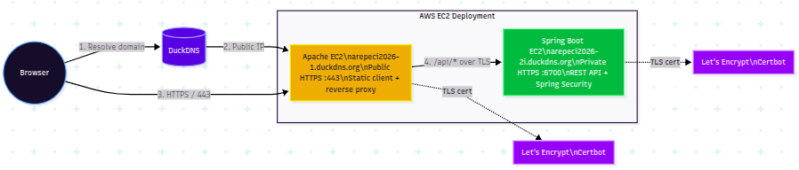
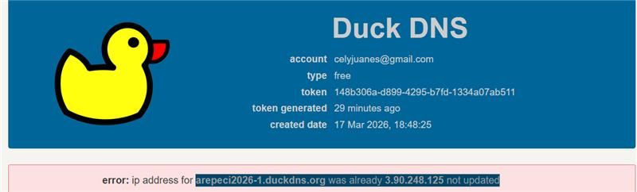
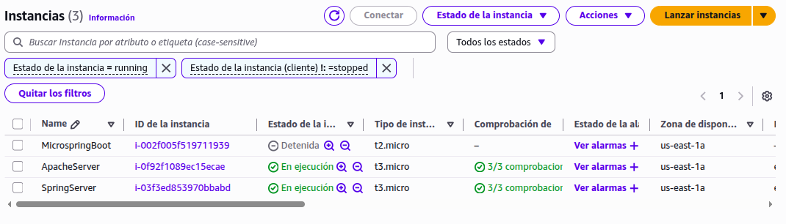
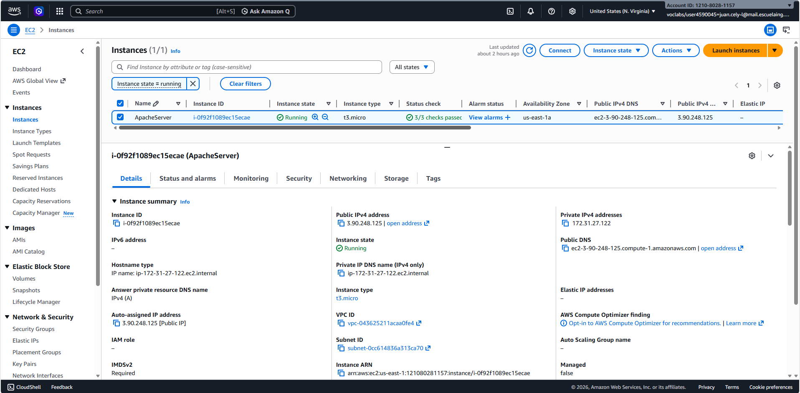
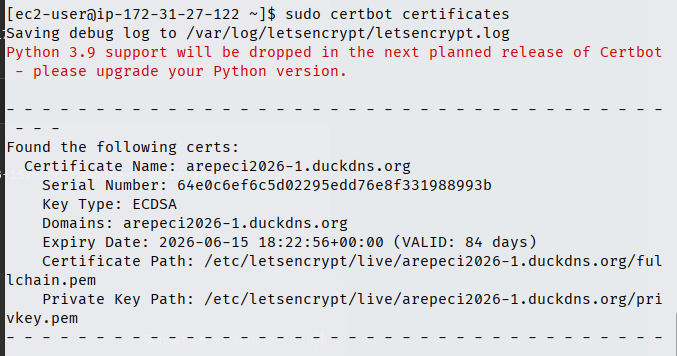
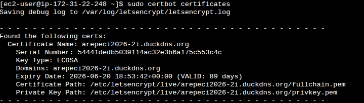
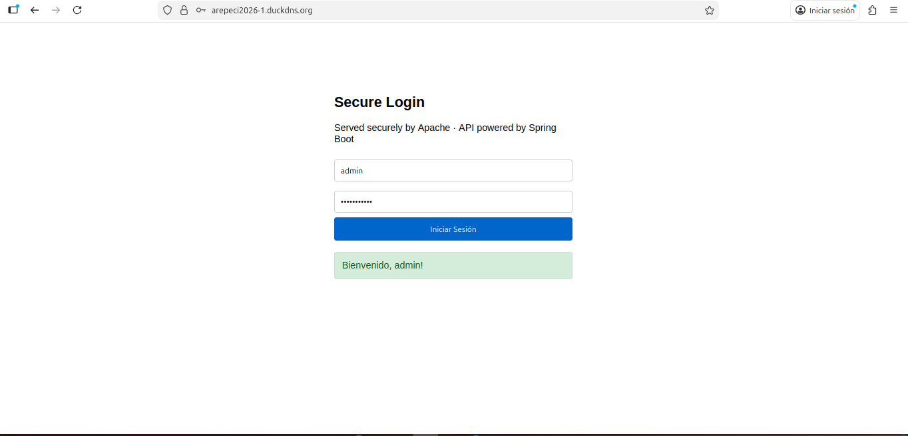
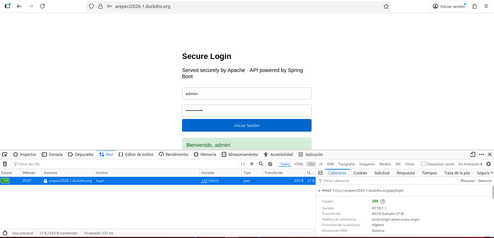

# Secure Application Design

A production-grade, two-server web application deployed on AWS that demonstrates enterprise security practices including TLS encryption, reverse proxy architecture, asynchronous client communication, and secure password storage.

---

## Table of Contents

- [Architecture Overview](#architecture-overview)
- [Security Features](#security-features)
- [Project Structure](#project-structure)
- [Prerequisites](#prerequisites)
- [Deployment Instructions](#deployment-instructions)
- [Configuration Reference](#configuration-reference)
- [Testing](#testing)
- [Visual Evidence](#visual-evidence)
- [Explanation Video](#explanation-video)

---

## Architecture Overview

The system is built on two independent EC2 instances on AWS, each with a dedicated role. Apache is the public entry point; Spring Boot stays behind it and only receives traffic through the reverse proxy.



This layout keeps the public attack surface small and makes the traffic flow easy to follow.

### Component Roles

**Server 1 — Apache (arepeci2026-1.duckdns.org)**

Apache is responsible for two tasks. First, it serves the static HTML and JavaScript client to the browser over a secure HTTPS connection. Second, it acts as a reverse proxy, forwarding all requests under the `/api/` path to the Spring Boot server. This means the browser never communicates directly with Spring — Apache mediates all traffic. The TLS certificate on Apache is issued by Let's Encrypt and managed by Certbot.

**Server 2 — Spring Boot (arepeci2026-2i.duckdns.org)**

Spring Boot handles all backend logic. It exposes RESTful API endpoints, validates user credentials, and returns JSON responses. It is not exposed directly to the internet; it only receives traffic from Apache's internal reverse proxy over the private AWS network. It also uses a Let's Encrypt certificate, converted to PKCS12 format for Java's SSL stack.

**Client — Asynchronous HTML + JavaScript**

The client is a single HTML file served by Apache. It uses the `fetch()` API with `async/await` to communicate with the Spring REST API without page reloads. This is the foundation of modern Single Page Application architecture: the UI updates dynamically based on JSON responses from the backend.

---

## Security Features

### TLS Encryption

Both servers use valid TLS certificates issued by Let's Encrypt, a free and widely trusted Certificate Authority. This ensures:

- Data in transit between the browser and Apache is encrypted (HTTPS)
- Data between Apache and Spring is also encrypted (internal HTTPS via reverse proxy)
- Certificates are automatically renewed by Certbot's scheduled task

### Reverse Proxy

Apache's `mod_proxy` module intercepts all `/api/*` requests and forwards them to Spring's private IP on port 6700. The Spring server is never directly reachable from the public internet. This design reduces the attack surface significantly.

Apache configuration that enables this:

```apache
SSLProxyEngine on
SSLProxyVerify none
SSLProxyCheckPeerCN off
SSLProxyCheckPeerName off

ProxyPass        /api/ https://<spring-private-ip>:6700/api/
ProxyPassReverse /api/ https://<spring-private-ip>:6700/api/
RequestHeader set X-Forwarded-Proto "https"
```

### Password Hashing with BCrypt

Passwords are never stored or compared in plain text. Spring Security's `BCryptPasswordEncoder` applies the BCrypt algorithm, which has several important properties:

- It incorporates a random salt per hash, so two identical passwords produce different hashes
- It has a configurable cost factor that makes it intentionally slow, resisting brute-force and rainbow table attacks
- The `passwordEncoder.matches()` method performs a constant-time comparison to prevent timing attacks

### Spring Security Filter Chain

Every HTTP request to the Spring server passes through Spring Security's filter chain before reaching any controller. The configuration explicitly defines which endpoints are public (`/api/login`) and which require authentication, following the principle of deny-by-default.

### CORS Policy

Spring is configured to accept cross-origin requests only from the Apache server's domain. This prevents unauthorized web pages from making requests to the API on behalf of a user.

---

## Project Structure

```
Secure-Application-Design/
├── SecureSpring/
│   ├── src/
│   │   └── main/
│   │       ├── java/org/example/
│   │       │   ├── Secureweb.java          # Spring Boot entry point
│   │       │   ├── SecurityConfig.java     # Spring Security + BCrypt + CORS
│   │       │   ├── LoginController.java    # REST endpoints: /api/login, /api/hello
│   │       │   └── HelloController.java    # Basic health check endpoint
│   │       └── resources/
│   │           └── application.properties  # SSL keystore configuration
│   ├── keystores/
│   │   └── ecikeystore.p12                 # PKCS12 keystore (development)
│   └── pom.xml                             # Maven dependencies
├── index.html                              # Async HTML+JS client (served by Apache)
├── Assets/                                 # Architecture diagrams, screenshots, and video evidence
└── README.md
```

---

## Prerequisites

### AWS Requirements

- Two EC2 instances running Amazon Linux 2023 (t3.micro is sufficient)
- One public IP per instance (Elastic IP recommended for production)
- Two DuckDNS subdomains pointing to each instance's public IP

### Security Group Rules

**Apache EC2**

| Port | Protocol | Source    | Purpose                   |
|------|----------|-----------|---------------------------|
| 22   | TCP      | 0.0.0.0/0 | SSH access                |
| 80   | TCP      | 0.0.0.0/0 | HTTP (Certbot validation) |
| 443  | TCP      | 0.0.0.0/0 | HTTPS (public traffic)    |

**Spring EC2**

| Port | Protocol | Source                | Purpose                  |
|------|----------|-----------------------|--------------------------|
| 22   | TCP      | 0.0.0.0/0             | SSH access               |
| 80   | TCP      | 0.0.0.0/0             | Certbot validation       |
| 443  | TCP      | 0.0.0.0/0             | HTTPS                    |
| 6700 | TCP      | Apache EC2 private IP | Spring API (internal)    |

### Local Requirements

- Java 21 (for compiling the Spring project)
- Maven 3.8+
- SSH key pair (.pem file) for EC2 access

---

## Deployment Instructions

### Part 1 — Apache Server (EC2 1)

**Step 1.1 — Install and start Apache**

```bash
sudo yum update -y
sudo yum install httpd -y
sudo systemctl start httpd
sudo systemctl enable httpd
```

**Step 1.2 — Update DuckDNS with the current public IP**

```bash
curl "https://www.duckdns.org/update?domains=YOUR-DOMAIN&token=YOUR-TOKEN&ip="
```

Verify that the domain resolves to your EC2's public IP before proceeding to certificate generation.

**Step 1.3 — Install Certbot and obtain the Let's Encrypt certificate**

```bash
sudo yum install certbot python3-certbot-apache -y
sudo certbot --apache -d YOUR-DOMAIN.duckdns.org
```

Certbot will automatically configure Apache's VirtualHost for HTTPS and set up auto-renewal.

**Step 1.4 — Allow Apache to make outbound connections (SELinux)**

Amazon Linux 2023 runs SELinux in enforcing mode by default. Apache requires explicit permission to make outbound network connections to the Spring server:

```bash
sudo setsebool -P httpd_can_network_connect 1
```

**Step 1.5 — Configure the reverse proxy**

Open the SSL VirtualHost file created by Certbot:

```bash
sudo nano /etc/httpd/conf.d/YOUR-DOMAIN-le-ssl.conf
```

Add the following lines inside the `<VirtualHost *:443>` block, before the closing tag:

```apache
SSLProxyEngine on
SSLProxyVerify none
SSLProxyCheckPeerCN off
SSLProxyCheckPeerName off

ProxyPass        /api/ https://<SPRING-PRIVATE-IP>:6700/api/
ProxyPassReverse /api/ https://<SPRING-PRIVATE-IP>:6700/api/
RequestHeader set X-Forwarded-Proto "https"
```

Replace `<SPRING-PRIVATE-IP>` with the private IPv4 address of your Spring EC2 (visible in the AWS Console under Instance Details).

**Step 1.6 — Deploy the HTML+JS client**

```bash
sudo nano /var/www/html/index.html
# Paste the contents of index.html from this repository
# Update the API_URL constant to match your Apache domain
```

**Step 1.7 — Validate and restart Apache**

```bash
sudo apachectl configtest
# Must return: Syntax OK
sudo systemctl restart httpd
```

---

### Part 2 — Spring Boot Server (EC2 2)

**Step 2.1 — Install Java 21**

```bash
sudo yum install java-21-amazon-corretto -y
java -version
```

**Step 2.2 — Compile the Spring project locally**

On your local machine, inside the `SecureSpring/` directory:

```bash
mvn clean package -DskipTests
```

The compiled JAR will be at `target/SecureSpring-1.0-SNAPSHOT.jar`.

**Step 2.3 — Upload the JAR to the Spring EC2**

```bash
scp -i "your-key.pem" \
    target/SecureSpring-1.0-SNAPSHOT.jar \
    ec2-user@<SPRING-PUBLIC-IP>:/home/ec2-user/
```

**Step 2.4 — Install Certbot and obtain the Let's Encrypt certificate**

```bash
sudo yum install certbot -y

sudo certbot certonly --standalone \
  -d YOUR-SPRING-DOMAIN.duckdns.org \
  --email your@email.com \
  --agree-tos \
  --non-interactive
```

The `--standalone` flag tells Certbot to temporarily start its own HTTP server on port 80 to complete the domain validation challenge. Port 80 must be open in the Security Group.

**Step 2.5 — Convert the certificate to PKCS12 format**

Spring Boot's embedded Tomcat requires the certificate in PKCS12 (Java keystore) format. The following command bundles the certificate chain and private key into a single `.p12` file:

```bash
sudo openssl pkcs12 -export \
  -in /etc/letsencrypt/live/YOUR-SPRING-DOMAIN.duckdns.org/fullchain.pem \
  -inkey /etc/letsencrypt/live/YOUR-SPRING-DOMAIN.duckdns.org/privkey.pem \
  -out /home/ec2-user/letsencrypt.p12 \
  -name letsencrypt \
  -passout pass:123456

sudo chmod 644 /home/ec2-user/letsencrypt.p12
```

The `chmod 644` is required because the file is created by `sudo` and Spring runs as the `ec2-user`, which would otherwise be denied read access.

**Step 2.6 — Start the Spring Boot application**

```bash
nohup java -jar /home/ec2-user/SecureSpring-1.0-SNAPSHOT.jar \
  --server.port=6700 \
  --server.ssl.key-store=/home/ec2-user/letsencrypt.p12 \
  --server.ssl.key-store-password=123456 \
  --server.ssl.key-alias=letsencrypt \
  > /home/ec2-user/spring.log 2>&1 &
```

`nohup` ensures the process continues running after the SSH session ends. Monitor the startup log:

```bash
tail -f /home/ec2-user/spring.log
```

A successful startup produces:

```
Tomcat started on port 6700 (https) with context path ''
Started Secureweb in 4.5 seconds
```

---

## Configuration Reference

### application.properties

```properties
server.ssl.key-store-type=PKCS12
server.ssl.key-store=keystores/ecikeystore.p12
server.ssl.key-store-password=123456
server.ssl.key-alias=ecikeypair
server.ssl.enabled=true
```

### SecurityConfig.java — Key Design Decisions

```java
// BCrypt is used instead of MD5 or SHA because it is:
// 1. Slow by design (cost factor = 10 rounds by default)
// 2. Salted automatically (no rainbow table attacks)
// 3. The industry standard for password storage
@Bean
public PasswordEncoder passwordEncoder() {
    return new BCryptPasswordEncoder();
}

// Only /api/login is public. All other endpoints require authentication.
// This follows the deny-by-default security principle.
.authorizeHttpRequests(auth -> auth
    .requestMatchers("/api/login").permitAll()
    .anyRequest().authenticated()
)

// CORS is restricted to the Apache server's domain only.
// This prevents unauthorized origins from calling the API.
config.addAllowedOrigin("https://arepeci2026-1.duckdns.org");
```

---

## Testing

### Verify the client loads over HTTPS

Open in a browser:

```
https://arepeci2026-1.duckdns.org
```

The browser should display the login form with a valid padlock. Clicking the padlock should show a certificate issued by **Let's Encrypt** for the Apache domain.

### Verify the login API through the reverse proxy

```bash
curl -X POST https://arepeci2026-1.duckdns.org/api/login \
  -H "Content-Type: application/json" \
  -d '{"username":"admin","password":"Password123"}'
```

Expected response:

```json
{"success": true, "message": "Login exitoso", "user": "admin"}
```

### Verify Let's Encrypt certificates on both servers

Run this command on each EC2 via SSH:

```bash
sudo certbot certificates
```

Expected output:

```
Found the following certs:
  Certificate Name: YOUR-DOMAIN.duckdns.org
    Domains: YOUR-DOMAIN.duckdns.org
    Expiry Date: 2026-06-XX (VALID: 89 days)
    Certificate Path: /etc/letsencrypt/live/YOUR-DOMAIN/fullchain.pem
    Private Key Path: /etc/letsencrypt/live/YOUR-DOMAIN/privkey.pem
```

### Verify Spring is reachable from Apache (internal network)

From the Apache EC2:

```bash
curl -k https://<SPRING-PRIVATE-IP>:6700/api/hello
```

### Test credentials

| Username | Password    |
|----------|-------------|
| admin    | Password123 |

---

## Visual Evidence

The screenshots below document the deployment from DNS and AWS provisioning to certificates, browser trust, and application behavior.

### Infrastructure and DNS

#### DuckDNS domain mapping



This capture shows the DuckDNS dashboard for `arepeci2026-1.duckdns.org`. It confirms the domain points to the expected public IP before the Apache certificate is requested.

#### AWS EC2 instances



This view shows the deployment split into ApacheServer and SpringServer, both running, with the local micro instance kept stopped.

#### AWS instance details



This screenshot highlights the Apache EC2 details, including the public IPv4 address, private IPv4 address, availability zone, and public DNS name used in the deployment.

### Certificates and Trust

#### Apache certificate



This terminal output confirms that Certbot issued a valid certificate for `arepeci2026-1.duckdns.org` on the Apache server.

#### Spring certificate



This output confirms the certificate for `arepeci2026-2i.duckdns.org` used by Spring Boot on port 6700.

#### Browser padlock


This browser popup verifies that the site is trusted and the certificate is issued by Let's Encrypt.

### Application Validation

#### Local Spring check

.jpg>)

This local test confirms that Spring Boot responds on `https://localhost:6700` before traffic is consumed through Apache.

#### Public Apache check

.jpg>)

This public test confirms that the Apache endpoint is reachable over HTTPS and serves the expected `It works!` response.

#### Login page



This screenshot shows the login form after a successful authentication, including the green confirmation message.

#### Network request



This DevTools capture proves that the browser sent an asynchronous `POST /api/login` request and received a `200 OK` JSON response through the reverse proxy.

## Explanation Video

The full walkthrough of the deployment and validation is available here:

[Watch the explanation video](<Assets/2026-03-22 15-18-37.mkv>)
